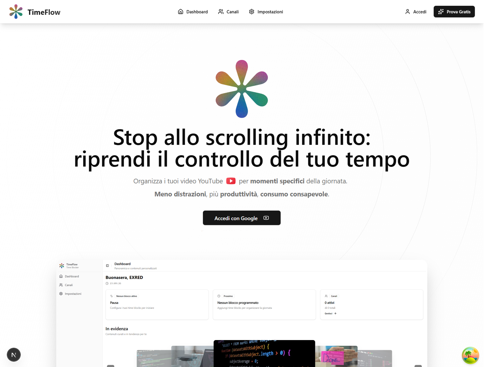
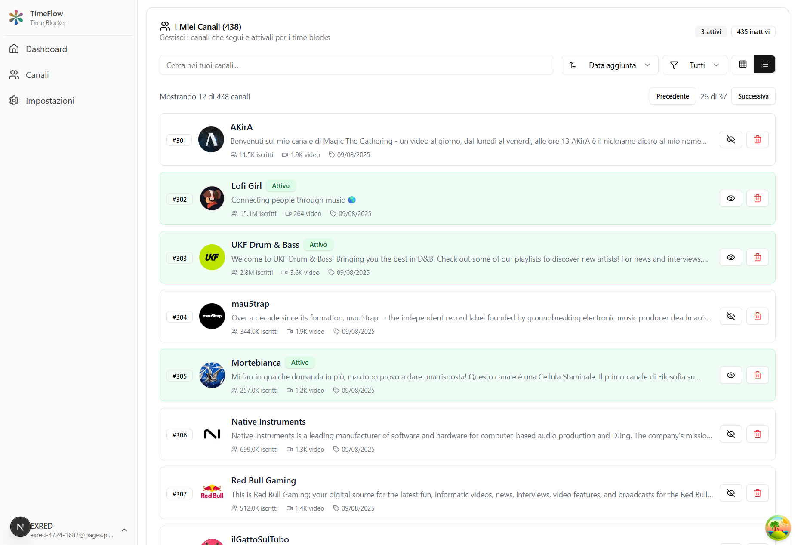
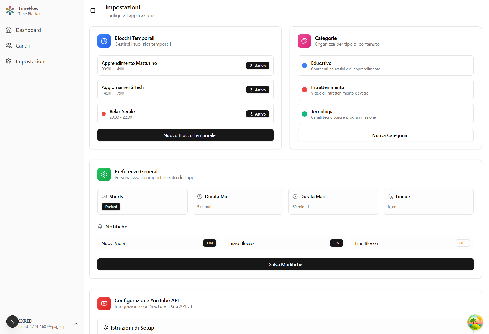

  
  
  
  # YouTube Time Controller
  
  > Trasforma YouTube da "buco nero del tempo" a strumento di apprendimento strutturato
  
  
  

---

## 🤔 Il Problema (Molto Personale)

Non guardo più la TV da anni. Quando non leggo, non gioco o non esco con gli amici, YouTube è il mio momento sacro.

**Il problema non è YouTube - è come lo uso.**

### La Mia Routine YouTube (Pre-App):
- **Mattina**: Apro per vedere tutorial React o trucchi UI/UX design
- **5 minuti dopo**: Sto guardando shorts di sport random
- **10 minuti dopo**: Video su alieni e misteriose antiche civiltà (la mia VERA passione notturna xD)
- **2 ore dopo**: Non ricordo nemmeno cosa stavo cercando all'inizio

### Il Vero Problema:
- ✅ **YouTube ha contenuti fantastici** - tutorial, documentari, sport, crime stories
- ❌ **Feed caotico** - algoritmo ti bombarda di input continui
- ❌ **Dipendenza da Shorts** - scorrimento infinito che devora tempo prezioso  
- ❌ **Cambio di contesto** - parti per studiare, finisci a guardare UFO

**Non voglio eliminare YouTube. Voglio usarlo MEGLIO.**

---

## 💡 La Mia Soluzione

### Concept: "YouTube TV Controllata"
Invece di un feed caotico, creo la MIA programmazione:

**🌅 Mattina (9-12): Blocco Apprendimento**
- Tutorial web design
- Consigli e trucchi di programmazione
- Ispirazione UI/UX
- Solo canali educativi selezionati

**🌆 Sera (20-22): Blocco Relax**  
- Documentari alieni e misteri egizi 👽
- Storie criminali e investigazioni
- Video calcio e sport in generale
- Contenuti di intrattenimento

**🚫 Modalità Zero Shorts**
- Niente scorrimento infinito
- Niente distrazioni casuali
- Solo contenuti lunghi e di qualità

### Come Funziona:
1. **Pulizia Lista Canali** - Seleziono solo quelli che mi interessano davvero
2. **Categorie Personalizzate** - Divido per Apprendimento, Sport, Misteri, ecc.
3. **Blocchi Temporali** - L'app mostra solo contenuti del blocco attivo
4. **Opzione di Sovrascrittura** - Posso sempre disattivare per navigazione libera

---

## 🔍 Ricerca e Validazione

### Processo di Ricerca:
1. **Keywords Everywhere** → Bloccato da paywall €3/mese
2. **Google Ads Keyword Planner** → Riattivato account cancellato
3. **Claude AI** → Processato dati con JavaScript

### Risultati Sorprendenti:
- **67.100 ricerche/mese** per "youtube timer", "gestire youtube"
- **100% keywords bassa competizione** 
- **Crescita +347%** negli ultimi 4 anni
- **Colpo di scena**: Tutti bloccano YouTube, nessuno aiuta a usarlo meglio

### Principali Parole Chiave Trovate:
| Parola Chiave | Volume/Mese | Competizione | Mercato |
|---------|-------------|-------------|---------|
| youtube timer | 5,000 | Low | IT |
| youtube addiction | 5,000 | Low | EN |
| block youtube | 5,000 | Low | EN |
| bloccare youtube | 500 | Low | IT |
| mindful youtube | 5,000 | Low | EN |

**Conclusione**: Il mercato esiste, problema reale, zero competizione diretta.

---

## ⚙️ Stack Tecnologico e Decisioni

*Premessa importante: Queste sono le scelte iniziali che sto utilizzando per il prototipo. Durante lo sviluppo molte cose potrebbero cambiare in base ai feedback e alle necessità che emergono.*

### Stack Tecnologico Attuale:
- **Frontend**: Next.js 15 con TypeScript e Tailwind CSS
- **State Management**: Zustand con TanStack Query  
- **Database**: Supabase (PostgreSQL)
- **Autenticazione**: NextAuth.js con Google OAuth
- **APIs**: YouTube Data API v3
- **UI Components**: Shadcn/ui con Framer Motion per le animazioni

### Perché queste scelte (per ora):

**Next.js invece di React puro**: Principalmente per il Server-Side Rendering che aiuta con la SEO e le performance. Inoltre l'App Router di Next.js 15 è molto comodo per organizzare le route dell'applicazione.

**Supabase invece di Firebase**: PostgreSQL mi sembra più adatto per gestire le relazioni complesse tra canali, categorie e time blocks. Inoltre Supabase ha funzionalità real-time integrate che potrebbero tornare utili.

**Zustand invece di Redux**: Molto meno codice da scrivere per ottenere lo stesso risultato. Per un'app di queste dimensioni Redux sarebbe probabilmente overkill.

Ripeto: tutto questo potrebbe cambiare durante lo sviluppo. Sono ancora in fase di sperimentazione.

---

## 🚧 Sfide e Soluzioni

### Sfida #1: Limiti API YouTube
*Questo è uno dei problemi tecnici principali che ho dovuto affrontare durante lo sviluppo.*

YouTube API permette solo 10.000 quota units al giorno. Una singola ricerca canale costa 100 units, il che significa che con 50 utenti attivi la quota finirebbe in poche ore.

La soluzione che sto implementando è un sistema di cache intelligente usando Supabase. L'idea è salvare i dati video nel database e servirli da lì invece di chiamare sempre l'API di YouTube. Finora i risultati sono buoni: la maggior parte delle richieste viene servita dalla cache e i tempi di risposta sono passati da 2 secondi a 200 millisecondi.

### Sfida #2: Gestione Stati Complessi
*Ancora in fase di sviluppo, sto sperimentando diverse soluzioni.*

L'app deve gestire time blocks, categorie, canali, preferenze utente e molti altri stati. Ho scelto Zustand perché più semplice di Redux ma più potente del semplice useState di React. Sto ancora definendo l'architettura finale dello stato.

### Sfida #3: Esperienza Utente per i Blocchi Temporali
*Questa è forse la sfida più importante - rendere il concetto facile da capire e usare.*

Come rendere intuitivo il concetto di assegnare canali a momenti specifici della giornata? Sto sperimentando con drag & drop e grid visuali. L'obiettivo è che anche chi non è tecnico capisca subito come funziona.

---

## 📊 Stato Attuale

*Importante: Questo è lo stato attuale del progetto. Essendo in sviluppo attivo, le funzionalità e le priorità cambiano frequentemente.*

### ✅ Funzionalità Completate:

**🏠 Dashboard**
- Time block attivo con countdown
- Stats canali e video  
- Grid video filtrati per orario
- Caricamento dati da cache

**📺 Gestione Canali**
- Import automatico iscrizioni YouTube
- Search e aggiunta manuale canali
- Toggle attivo/inattivo
- Assegnazione a time blocks

**🔧 API & Cache**
- YouTube Data API v3 integrata
- Sistema cache Supabase completo
- Gestione quota con fallback
- Auth Google OAuth funzionante

### ⚠️ In Fase di Sviluppo:

**⚙️ Pannello Impostazioni**
- Editor blocchi temporali (solo interfaccia)
- Gestore categorie (segnaposto)  
- Modulo preferenze (da implementare)

**📱 Esperienza Mobile**
- Design responsivo di base
- Interazioni touch da ottimizzare
- Funzionalità PWA da aggiungere

### 🎯 Prossimi Traguardi:
*Roadmap molto approssimativa - le priorità cambiano in base ai feedback e ai problemi che emergono durante lo sviluppo.*

**Prossime settimane**: Completare il panel settings funzionale
**Più avanti**: Ottimizzazione mobile e funzionalità PWA
**Eventualmente**: Beta testing con primi utenti
**Se tutto va bene**: Preparazione per un lancio pubblico

Tutto molto flessibile e dipendente da come va lo sviluppo e dai feedback che ricevo.

---

## 🎖️ Lezioni Apprese

### 💡 Intuizioni Tecniche:
1. **La cache è tutto** - Con i limiti API, una cache intelligente non è opzionale
2. **La gestione dello stato è importante** - Zustand equilibrio perfetto tra semplicità e potenza  
3. **L'API YouTube è complessa** - Molta logica nascosta, documentazione lacunosa

### 💡 Intuizioni di Prodotto:
1. **Validazione prima dello sviluppo** - 3 giorni di ricerca > 3 settimane di sviluppo cieco
2. **Problemi personali** - I tuoi problemi sono spesso problemi condivisi
3. **Nicchia > Generico** - "produttività YouTube" > "blocco social media"

### 💡 Intuizioni di Processo:
1. **Costruire in pubblico funziona** - Feedback e motivazione costanti
2. **Documenta tutto** - Il te del futuro (e altri) ti ringrazieranno
3. **Mentalità MVP** - Rilasciare batte sempre perfezionare

---

## 🙏 Riconoscimenti

- **Next.js Team** - Framework fantastico
- **Supabase** - Backend-as-a-service che just works
- **Shadcn** - UI components bellissimi  
- **Claude AI** - Per aver processato i miei dati keyword
- **YouTube** - Per l'API (anche se limitata)
- **La Community Dev** - Consigli, feedback, supporto morale

---

## 📝 Licenza

Licenza MIT - Sentiti libero di fare fork, contribuire o usare per imparare.

**Se questo progetto ti ispira, l'unica cosa che chiedo è condividere quello che impari.** 🚀

---

## 📸 Screenshots

### 🏠 Dashboard Principale

*La dashboard mostra il time block attivo, statistiche e video filtrati per orario*

### 📺 Gestione Canali  

*Interfaccia per importare, gestire e assegnare canali YouTube ai time blocks*

### ⚙️ Impostazioni

*Panel delle impostazioni per configurare time blocks, categorie e preferenze*

---

## ⭐ Supporto

Se questo progetto ti è utile, lascia una stella! È l'unico modo per farmi sapere che vale la pena continuare.

---

## 🔗 Contatti

- **LinkedIn**: [Francesco Mancino](https://www.linkedin.com/in/francesco-mancino-dev/)
- **GitHub**: [freshgr4m](https://github.com/freshgr4m)

---

*Ultimo aggiornamento: Agosto 2025*  
*Costruito con ❤️ per una migliore esperienza YouTube*
