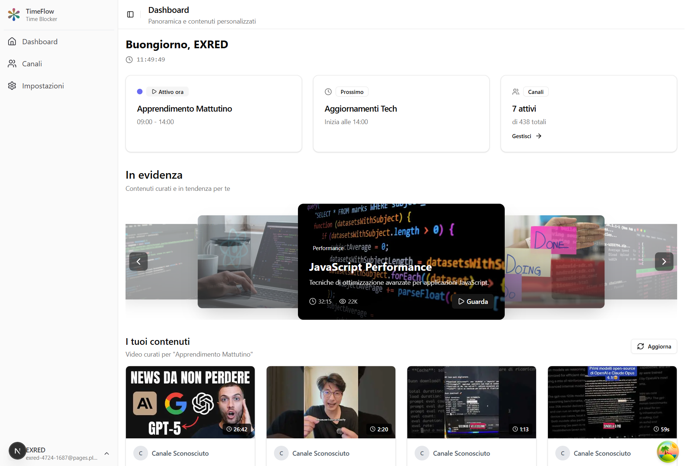

  
  
  
  # 🎯 YouTube Time Controller
  
  > Trasforma YouTube da "buco nero del tempo" a strumento di apprendimento strutturato
  
  
  

---

## 🤔 Il Problema (Molto Personale)

Non guardo più la TV da anni. Quando non leggo, non gioco o non esco con gli amici, YouTube è il mio momento sacro.

**Il problema non è YouTube - è come lo uso.**

### La Mia Routine YouTube (Pre-App):
- **Mattina**: Apro per vedere tutorial React o trucchi UI/UX design
- **5 minuti dopo**: Sto guardando shorts di calcio random
- **10 minuti dopo**: Video su alieni e misteri egizi (la mia VERA passione notturna 👽)
- **2 ore dopo**: Non ricordo nemmeno cosa stavo cercando all'inizio

### Il Vero Problema:
- ✅ **YouTube ha contenuti fantastici** - tutorial, documentari, calcio, crime stories
- ❌ **Feed caotico** - algoritmo ti bombarda di input continui
- ❌ **Shorts addition** - scroll infinito che devora tempo prezioso  
- ❌ **Context switching** - parti per studiare, finisci a guardare UFO

**Non voglio eliminare YouTube. Voglio usarlo MEGLIO.**

---

## 💡 La Mia Soluzione

### Concept: "YouTube TV Controllata"
Invece di un feed caotico, creo la MIA programmazione:

**🌅 Mattina (9-12): Learning Block**
- Tutorial web design
- Coding tips e tricks
- UI/UX inspiration
- Solo canali educational selezionati

**🌆 Sera (20-22): Relax Block**  
- Documentari alieni e misteri egizi 👽
- Storie crime e investigazioni
- Video calcio e highlights
- Contenuti entertainment

**🚫 Zero Shorts Mode**
- Niente scroll infinito
- Niente distrazioni casuali
- Solo contenuti lunghi e di qualità

### Come Funziona:
1. **Pulizia Lista Canali** - Seleziono solo quelli che mi interessano davvero
2. **Categorie Custom** - Divido per Learning, Sports, Mysteries, etc.
3. **Time Blocking** - App mostra solo contenuti del blocco attivo
4. **Override Option** - Posso sempre disattivare per navigazione libera

---

## 🔍 Research & Validation

### Processo di Ricerca:
1. **Keywords Everywhere** → Bloccato da paywall €3/mese
2. **Google Ads Keyword Planner** → Riattivato account cancellato
3. **Claude AI** → Processato dati con JavaScript

### Risultati Sorprendenti:
- **67.100 ricerche/mese** per "youtube timer", "gestire youtube"
- **100% keywords bassa competizione** 
- **Crescita +347%** negli ultimi 4 anni
- **Plot twist**: Tutti bloccano YouTube, nessuno aiuta a usarlo meglio

### Top Keywords Trovate:
| Keyword | Volume/Mese | Competizione | Mercato |
|---------|-------------|-------------|---------|
| youtube timer | 5,000 | Low | IT |
| youtube addiction | 5,000 | Low | EN |
| block youtube | 5,000 | Low | EN |
| bloccare youtube | 500 | Low | IT |
| mindful youtube | 5,000 | Low | EN |

**Conclusione**: Il mercato esiste, problema reale, zero competizione diretta.

---

## ⚙️ Tech Stack & Decisioni

*Premessa importante: Queste sono le scelte iniziali che sto utilizzando per il prototipo. Durante lo sviluppo molte cose potrebbero cambiare in base ai feedback e alle necessità che emergono.*

### Stack Attuale:
- **Frontend**: Next.js 15 con TypeScript e Tailwind CSS
- **State Management**: Zustand con TanStack Query  
- **Database**: Supabase (PostgreSQL)
- **Autenticazione**: NextAuth.js con Google OAuth
- **APIs**: YouTube Data API v3
- **UI Components**: Shadcn/ui con Framer Motion per le animazioni

### Perché queste scelte (per ora):

**Next.js invece di React puro**: Principalmente per il Server-Side Rendering che aiuta con la SEO e le performance. Inoltre l'App Router di Next.js 15 è molto comodo per organizzare le route dell'applicazione.

**Supabase invece di Firebase**: PostgreSQL mi sembra più adatto per gestire le relazioni complesse tra canali, categorie e time blocks. Inoltre Supabase ha funzionalità real-time integrate che potrebbero tornare utili.

**Zustand invece di Redux**: Molto meno codice da scrivere per ottenere lo stesso risultato. Per un'app di queste dimensioni Redux sarebbe probabilmente overkill.

Ripeto: tutto questo potrebbe cambiare durante lo sviluppo. Sono ancora in fase di sperimentazione.

---

## 🚧 Challenges & Solutions

### Challenge #1: YouTube API Limits
*Questo è uno dei problemi tecnici principali che ho dovuto affrontare durante lo sviluppo.*

YouTube API permette solo 10.000 quota units al giorno. Una singola ricerca canale costa 100 units, il che significa che con 50 utenti attivi la quota finirebbe in poche ore.

La soluzione che sto implementando è un sistema di cache intelligente usando Supabase. L'idea è salvare i dati video nel database e servirli da lì invece di chiamare sempre l'API di YouTube. Finora i risultati sono buoni: la maggior parte delle richieste viene servita dalla cache e i tempi di risposta sono passati da 2 secondi a 200 millisecondi.

### Challenge #2: Gestione Stati Complessi
*Ancora work in progress, sto sperimentando diverse soluzioni.*

L'app deve gestire time blocks, categorie, canali, preferenze utente e molti altri stati. Ho scelto Zustand perché più semplice di Redux ma più potente del semplice useState di React. Sto ancora definendo l'architettura finale dello stato.

### Challenge #3: UX per Time Blocking
*Questa è forse la sfida più importante - rendere il concept facile da capire e usare.*

Come rendere intuitivo il concetto di assegnare canali a momenti specifici della giornata? Sto sperimentando con drag & drop e grid visuali. L'obiettivo è che anche chi non è tecnico capisca subito come funziona.

---

## 📊 Current Status

*Importante: Questo è lo stato attuale del progetto. Essendo in sviluppo attivo, le funzionalità e le priorità cambiano frequentemente.*

### ✅ Funzionalità Completate:

**🏠 Dashboard**
- Time block attivo con countdown
- Stats canali e video  
- Grid video filtrati per orario
- Caricamento dati da cache

**📺 Gestione Canali**
- Import automatico iscrizioni YouTube
- Search e aggiunta manuale canali
- Toggle attivo/inattivo
- Assegnazione a time blocks

**🔧 API & Cache**
- YouTube Data API v3 integrata
- Sistema cache Supabase completo
- Gestione quota con fallback
- Auth Google OAuth funzionante

### ⚠️ Work in Progress:

**⚙️ Settings Panel**
- Time blocks editor (solo UI)
- Categories manager (placeholder)  
- Preferences form (da implementare)

**📱 Mobile Experience**
- Responsive design basic
- Touch interactions da ottimizzare
- PWA features da aggiungere

### 🎯 Next Milestones:
*Roadmap molto approssimativa - le priorità cambiano in base ai feedback e ai problemi che emergono durante lo sviluppo.*

**Prossime settimane**: Completare il panel settings funzionale
**Più avanti**: Ottimizzazione mobile e funzionalità PWA
**Eventualmente**: Beta testing con primi utenti
**Se tutto va bene**: Preparazione per un lancio pubblico

Tutto molto flessibile e dipendente da come va lo sviluppo e dai feedback che ricevo.

---

## 🧪 Want to Help?

### 🚀 Beta Testing
Cerco 10-15 beta tester che:
- Usano YouTube >1 ora/giorno
- Hanno lo stesso problema di "context switching"  
- Vogliono più controllo sui contenuti
- Danno feedback onesto (anche brutal)

### 🤝 Collaboration
Aperto a:
- **UI/UX feedback** - Sono dev, non designer
- **Content strategy** - Come spiegare meglio il concept?
- **Technical review** - Architecture decisions, performance
- **Partnership** - YouTube creators, productivity tools

### 📬 Contact
- **LinkedIn**: [Il tuo profilo LinkedIn]
- **GitHub Issues**: Per bugs e feature requests
- **Email**: [La tua email] per collaboration serie

---

## 🎖️ Lessons Learned

### 💡 Technical Insights:
1. **Cache è tutto** - Con API limits, cache intelligente non è optional
2. **State management matters** - Zustand perfect balance semplicità/potenza  
3. **YouTube API è complessa** - Molta logica hidden, documentazione lacunosa

### 💡 Product Insights:
1. **Validation before building** - 3 giorni di research > 3 settimane di dev blind
2. **Personal pain points** - I tuoi problemi sono spesso shared problems
3. **Niche > Generic** - "YouTube productivity" > "social media blocker"

### 💡 Process Insights:
1. **Build in public works** - Feedback e motivazione costante
2. **Document everything** - Future you (e altri) ringrazieranno
3. **MVP mentality** - Shipping beats perfecting sempre

---

## 📈 Future Vision

### Short Term (3-6 mesi):
- 100+ utenti attivi
- Mobile app (React Native?)
- Advanced analytics (tempo risparmiato, focus improvement)

### Medium Term (6-12 mesi):  
- Integrazione altri video platforms (Vimeo, Twitch?)
- AI content categorization
- Social features (shared time blocks?)

### Long Term (1-2 anni):
- Productivity suite completa
- Enterprise version per aziende
- API pubblica per developers

**L'obiettivo non è fare i milioni. È risolvere un problema reale per persone reali.** 

---

## 🙏 Credits

- **Next.js Team** - Framework fantastico
- **Supabase** - Backend-as-a-service che just works
- **Shadcn** - UI components bellissimi  
- **Claude AI** - Per aver processato i miei dati keyword
- **YouTube** - Per l'API (anche se limitata)
- **La Community Dev** - Consigli, feedback, supporto morale

---

## 📝 License

MIT License - Feel free to fork, contribute, or use for learning.

**Se questo progetto ti ispira, l'unica cosa che chiedo è condividere quello che impari.** 🚀

---

## 📸 Screenshots

### 🏠 Dashboard Principale

*La dashboard mostra il time block attivo, statistiche e video filtrati per orario*

### 📺 Gestione Canali  

*Interfaccia per importare, gestire e assegnare canali YouTube ai time blocks*

### ⚙️ Impostazioni

*Panel delle impostazioni per configurare time blocks, categorie e preferenze*

---

## ⭐ Support

Se questo progetto ti è utile, lascia una stella! È l'unico modo per farmi sapere che vale la pena continuare.

---

*Ultimo update: Agosto 2025*  
*Built with ❤️ for a better YouTube experience*
